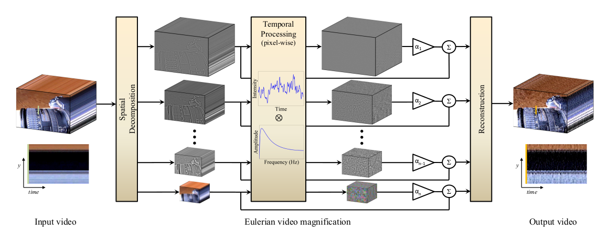

# Eulerian Video Magnification

[](https://colab.research.google.com/github/joeljose/Eulerian-Video-Magnification/blob/main/Eulerian_Video_Magnification.ipynb)

Eulerian video magnification reveals temporal variations in videos that are difficult or impossible to see with the naked eye. It can amplify subtle color changes — like the flush of blood under skin with each heartbeat — or tiny motions, making them clearly visible.


**Figure 1: Original video, 20X magnified, and 100X magnified.**

This is a Python implementation of MIT CSAIL's paper, ["Eulerian Video Magnification for Revealing Subtle Changes in the World"](https://people.csail.mit.edu/mrub/papers/vidmag.pdf) (Wu et al., SIGGRAPH 2012).

---

## Table of Contents

- [Theory](#theory)
  - [Eulerian vs Lagrangian](#eulerian-vs-lagrangian)
  - [Algorithm Pipeline](#algorithm-pipeline)
  - [The Taylor Expansion Argument](#the-taylor-expansion-argument)
  - [Applications](#applications)
  - [Limitations](#limitations)
- [Implementation](#implementation)
  - [Color Space](#color-space)
  - [Temporal Filtering](#temporal-filtering)
  - [Adaptive Amplification](#adaptive-amplification)
  - [Optimizations (CLI only)](#optimizations-cli-only)
- [Setup](#setup)
  - [A. Google Colab](#a-google-colab)
  - [B. Local Setup](#b-local-setup)
  - [C. Docker](#c-docker)
  - [D. GPU (CUDA)](#d-gpu-cuda)
- [Usage](#usage)
  - [CLI Tool](#cli-tool)
  - [GPU CLI Tool](#gpu-cli-tool)
  - [Notebook](#notebook)
  - [Tips](#tips)
- [Development](#development)
  - [Running Tests](#running-tests)
  - [Versioning](#versioning)
  - [Project Structure](#project-structure)
- [References](#references)

---

## Theory

### Eulerian vs Lagrangian

There are two fundamental approaches to analyzing motion in video:

- **Lagrangian** — track individual points across frames (optical flow). Works well for large motions but struggles with sub-pixel changes.
- **Eulerian** — observe how pixel values change over time at fixed spatial locations. This is what EVM uses.

The key insight is that for small motions, the temporal intensity change at a fixed pixel is proportional to the spatial gradient multiplied by the displacement. By amplifying these temporal changes, we can make invisible motions visible — without ever computing motion trajectories.

### Algorithm Pipeline



The algorithm has four main stages:

**1. Spatial Decomposition (Laplacian Pyramid)**

Each video frame is decomposed into a Laplacian pyramid — a multi-scale representation where each level captures spatial details at a different frequency band. This separates fine details from coarse structure, allowing the algorithm to amplify motion at specific spatial scales independently.

A Gaussian pyramid is built by repeatedly downsampling with `cv2.pyrDown`. The Laplacian pyramid is the difference between consecutive Gaussian levels:

$$L_i = G_i - \text{pyrUp}(G_{i+1})$$

**2. Temporal Filtering (Bandpass)**

At each spatial location and pyramid level, pixel values are treated as a 1D time-series signal. An ideal bandpass filter (implemented via FFT) extracts only the temporal frequencies of interest:

- For **color magnification** (e.g., pulse detection): low frequencies, typically 0.5–2 Hz
- For **motion magnification** (e.g., vibrations): higher frequencies matching the motion

The FFT is computed along the time axis, frequencies outside $[f_{min}, f_{max}]$ are zeroed out, and the inverse FFT recovers the filtered signal.

**3. Amplification**

The filtered signal is multiplied by an amplification factor $\alpha$ and added back to the original pyramid level:

$$\hat{L}_i(t) = L_i(t) + \alpha \cdot \text{BPF}(L_i(t))$$

where $\text{BPF}$ is the bandpass-filtered version of the signal. Higher $\alpha$ values produce more visible magnification but introduce more artifacts.

**4. Reconstruction**

The modified Laplacian pyramid is collapsed back into a full-resolution video by iteratively upsampling and adding:

$$\hat{G}_i = \text{pyrUp}(\hat{G}_{i+1}) + \hat{L}_i$$

### The Taylor Expansion Argument

The theoretical justification for why temporal filtering reveals motion comes from a first-order Taylor expansion. For a 1D image signal $I(x, t)$ undergoing small translation $\delta(t)$:

$$I(x, t) = f(x + \delta(t))$$

By Taylor expansion:

$$I(x, t) \approx f(x) + \delta(t) \frac{\partial f}{\partial x}$$

The temporal variation at a fixed pixel $x$ is $\delta(t) \frac{\partial f}{\partial x}$. After bandpass filtering and amplifying by $\alpha$, the reconstructed signal becomes:

$$\hat{I}(x, t) \approx f(x) + (1 + \alpha) \cdot \delta(t) \frac{\partial f}{\partial x} \approx f(x + (1 + \alpha)\delta(t))$$

The motion $\delta(t)$ is effectively amplified to $(1 + \alpha)\delta(t)$. This holds as long as the motion remains small relative to the spatial wavelength of the image features — which is why the pyramid decomposition is important: it lets us match the amplification to the appropriate spatial scale.

### Applications

| Application | Frequency Band | Amplification | What It Reveals |
|---|---|---|---|
| Pulse detection | 0.5–2 Hz | 50–150x | Blood flow causing subtle skin color changes |
| Breathing | 0.1–0.5 Hz | 10–30x | Chest/body movement during respiration |
| Structural vibration | 1–50 Hz | 20–100x | Building sway, bridge vibrations |
| Musical vibration | 50–500 Hz | 50–200x | Object vibrations from sound |

### Limitations

- **Artifacts at high amplification** — when $\alpha$ is too large relative to the spatial wavelength, the first-order approximation breaks down and produces ringing/ghosting artifacts.
- **Noise amplification** — the algorithm amplifies all temporal variations in the frequency band, including sensor noise. Low-light or noisy videos produce poor results.
- **Large motion** — the Eulerian approach assumes small motions. Objects with significant displacement across frames will not be correctly magnified.
- **No occlusion handling** — since we observe fixed pixel locations, occluded regions cannot be recovered.

---

## Implementation

### Color Space

Video is converted to YIQ (NTSC) color space using the same matrices as MATLAB's `rgb2ntsc`/`ntsc2rgb`. This separates luminance (Y) from chrominance (I, Q), enabling independent control of color amplification via the `--chrom-attenuation` flag.

### Temporal Filtering

Ideal bandpass filtering via FFT, matching MATLAB's `ideal_bandpassing.m`. Uses a one-sided frequency mask (positive frequencies only) and takes `real(ifft(...))` — the real part, not the absolute value. This preserves the sign of the filtered signal so pixels oscillate above and below their mean, correctly representing the temporal variation.

### Adaptive Amplification

Per-level alpha is computed based on `lambda_c` and the representative spatial wavelength at each pyramid level (Figure 6 of the paper). This prevents over-amplification of fine spatial details beyond what the first-order Taylor expansion supports. Two levels are zeroed out:

- **Level 0 (finest, full resolution)** — captures the highest spatial frequencies (sharpest edges and fine details). The spatial wavelengths are so short that even modest amplification breaks the first-order Taylor approximation, producing ringing and ghosting artifacts.
- **Coarsest level (low-pass residual)** — this is not a true bandpass level; it is the Gaussian remainder (`gauss[-1]`) appended directly to the pyramid. It contains the DC component (overall mean intensity), so amplifying it would shift global brightness rather than reveal temporal variations.

### Optimizations (CLI only)

- Skip FFT on zeroed levels (level 0 and coarsest)
- Free intermediate arrays immediately after use
- Vectorized YIQ conversion
- Progress reporting with ETA
- Nyquist frequency validation

---

## Setup

### A. Google Colab

The easiest way to try the notebook — click the badge at the top of this README. No installation needed.

### B. Local Setup

**CLI tool** (recommended for processing your own videos):

```bash
git clone https://github.com/joeljose/Eulerian-Video-Magnification.git
cd Eulerian-Video-Magnification
pip install -r requirements.txt
python evm.py -i input.mp4
```

**Notebook** (for interactive exploration and learning):

```bash
pip install -r requirements.txt matplotlib requests
jupyter notebook Eulerian_Video_Magnification.ipynb
```

**Requirements:** Python 3.8+

### C. Docker

```bash
# Build (tags as evm:<version> and evm:latest)
./docker-build.sh

# Run
docker run --rm -it \
    -v "$(pwd)":/app/data \
    evm \
    -i /app/data/input.mp4 -o /app/data/output.avi
```

### D. GPU (CUDA)

For faster processing on NVIDIA GPUs.

**Prerequisites:**
- NVIDIA GPU with CUDA support (CUDA 12.x+)
- [NVIDIA drivers](https://www.nvidia.com/Download/index.aspx) installed on the host
- [Docker](https://docs.docker.com/get-docker/)
- [NVIDIA Container Toolkit](https://docs.nvidia.com/datacenter/cloud-native/container-toolkit/install-guide.html) — allows Docker to access the GPU

**Verify your GPU is accessible:**
```bash
nvidia-smi  # Should show your GPU name, driver version, and CUDA version
```

**Build the CUDA Docker image:**
```bash
./docker-build-cuda.sh
```

**Run on your video:**
```bash
# Basic usage — magnify face.mp4 with default settings
docker run --gpus all --rm \
    -v "$(pwd)":/data \
    evm-cuda \
    -i /data/face.mp4 -o /data/face_magnified.avi

# Pulse detection (0.83–1.0 Hz, 50x amplification)
docker run --gpus all --rm \
    -v "$(pwd)":/data \
    evm-cuda \
    -i /data/face.mp4 -o /data/face_magnified.avi \
    -fl 0.83 -fh 1.0 -a 50

# Select a specific GPU (for multi-GPU systems)
docker run --gpus all --rm \
    -v "$(pwd)":/data \
    evm-cuda \
    -i /data/input.mp4 -o /data/output.avi --device 1
```

The GPU version runs the entire EVM pipeline on GPU using CuPy (backed by cuFFT). It automatically checks available VRAM before processing and exits with a clear error if the video is too large.

**VRAM requirements:** Depends on video resolution and length. The tool prints exact requirements before starting. As a rough guide: a 300-frame 264x296 video needs ~0.5 GB, a 1080p 30s video at 30fps needs ~4-5 GB.

---

## Usage

### CLI Tool

```bash
python evm.py -i face.mp4
python evm.py -i face.mp4 -o magnified.avi -a 50 -fl 0.83 -fh 1.0
python evm.py -i guitar.mp4 -fl 72 -fh 92 -a 50 --lambda-c 10 --chrom-attenuation 0
```

| Flag | Default | Description |
|---|---|---|
| `-i / --input` | *(required)* | Input video path |
| `-o / --output` | `<input>_magnified.avi` | Output video path |
| `-fl / --freq-low` | 0.5 | Lower cutoff frequency (Hz) |
| `-fh / --freq-high` | 2.0 | Upper cutoff frequency (Hz) |
| `-a / --amplification` | 50 | Amplification factor (alpha) |
| `--pyramid-levels` | 4 | Number of Laplacian pyramid levels |
| `--lambda-c` | 1000 | Cutoff spatial wavelength (see paper Figure 6) |
| `--chrom-attenuation` | 1.0 | Color channel attenuation (0=luminance only, 1=full) |
| `--version` | — | Show program version and exit |

### GPU CLI Tool

Same flags as the CPU version, plus `--device`. The recommended way to run is via Docker (see [GPU setup](#d-gpu-cuda) above). If running outside Docker:

```bash
pip install -r requirements-cuda.txt
python evm_cuda.py -i face.mp4
python evm_cuda.py -i face.mp4 -a 50 -fl 0.83 -fh 1.0 --device 0
```

| Additional Flag | Default | Description |
|---|---|---|
| `--device` | 0 | CUDA device ID (for multi-GPU systems) |

The tool prints the GPU name, estimated VRAM usage, and available memory before processing.

### Notebook

Open the notebook and run all cells. By default, it downloads a sample face video from the original paper and magnifies it. To use your own video, change the `filename` variable.

### Tips

- Use `show_frequencies()` in the notebook to visualize frequency content before choosing cutoff frequencies.
- Start with low amplification and increase gradually.
- For pulse/color magnification: 0.5–2 Hz, high amplification (50+).
- For motion magnification: match the frequency band to the motion you want to reveal.

---

## Development

### Running Tests

All tests run inside Docker — no local Python dependencies needed. Build the test image once, then run tests as many times as you need:

```bash
# Build the CPU test image (first time, or after Dockerfile/dependency changes)
./docker-build.sh

# Run CPU unit tests (builds image automatically if not found)
./test.sh

# Run GPU unit tests (requires NVIDIA GPU + Container Toolkit)
./test.sh gpu

# Force rebuild before testing
./test.sh --build
```

**CPU tests** (`tests/test_evm.py`) cover:
- Color conversion roundtrip (YIQ ↔ RGB)
- Bandpass filter (passband, rejection, DC)
- Laplacian pyramid (reconstruction roundtrip, shapes, finite values)
- `load_video` buffer safety
- All CLI input validation error paths

**GPU tests** (`tests/test_evm_cuda.py`) cover:
- VRAM estimation
- GPU color conversion roundtrip
- GPU pyramid operations (pyrDown/pyrUp shapes, finite values)
- GPU bandpass filter

**Dev workflow:**
1. Make your changes
2. Run `./test.sh` (or `./test.sh gpu` for CUDA changes)
3. If all tests pass, commit and open a PR
4. CI runs lint + smoke tests automatically

### Versioning

Version is tracked in a `VERSION` file at the project root. Both `evm.py` and `evm_cuda.py` have `__version__` baked into the source (updated at release time).

**To cut a release:**
1. Update `VERSION` with the new version number
2. Update `__version__` in `evm.py` (e.g., `"2.1.0"`) and `evm_cuda.py` (e.g., `"2.1.0-cuda"`)
3. Update `CHANGELOG.md` — move items from `[Unreleased]` to `[X.Y.Z] - YYYY-MM-DD`
4. Commit: `Release vX.Y.Z`
5. Tag: `git tag -a vX.Y.Z -m "Release vX.Y.Z"`
6. Push: `git push && git push origin vX.Y.Z`
7. Rebuild Docker images: `./docker-build.sh` and `./docker-build-cuda.sh`

Docker build scripts read from `VERSION` and tag images accordingly (e.g., `evm:2.1.0`, `evm-cuda:2.1.0-cuda`). Images also carry a `version` label visible via `docker inspect`.

### Project Structure

```
evm.py                  # CPU CLI tool
evm_cuda.py             # GPU CLI tool (CuPy/CUDA)
Dockerfile              # CPU Docker image
Dockerfile.cuda         # GPU Docker image
docker-build.sh         # Build + tag CPU image
docker-build-cuda.sh    # Build + tag GPU image
test.sh                 # Run unit tests (cpu/gpu)
requirements.txt        # CPU runtime dependencies
requirements-cuda.txt   # GPU runtime dependencies
requirements-dev.txt    # Dev dependencies (pytest, ruff)
tests/
  test_evm.py           # CPU unit tests
  test_evm_cuda.py      # GPU unit tests
docs/design/            # Architecture decision records
VERSION                 # Single source of truth for version
CHANGELOG.md            # Release history
```

---

## References

1. Wu, H-Y., Rubinstein, M., Shih, E., Guttag, J., Durand, F., & Freeman, W. (2012). [Eulerian Video Magnification for Revealing Subtle Changes in the World](https://people.csail.mit.edu/mrub/papers/vidmag.pdf). *ACM Transactions on Graphics (SIGGRAPH)*, 31(4).

2. [MIT CSAIL — Eulerian Video Magnification Project Page](https://people.csail.mit.edu/mrub/evm/)

---

## Follow Me
<a href="https://x.com/joelk1jose" target="_blank"></a>
<a href="https://github.com/joeljose" target="_blank"></a>
<a href="https://www.linkedin.com/in/joel-jose-527b80102/" target="_blank"></a>

<h3 align="center">Show your support by starring the repository 🙂</h3>
