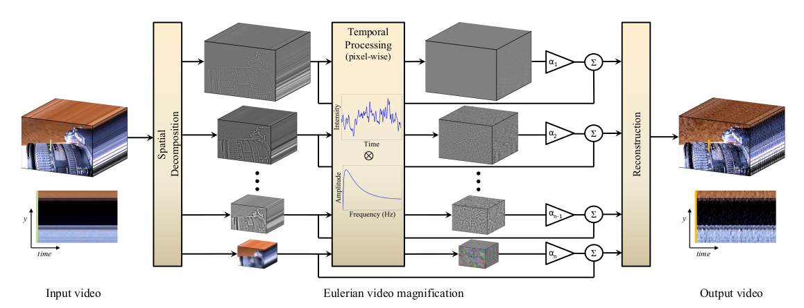

# Eulerian Video Magnification

[](https://colab.research.google.com/github/joeljose/Eulerian-Video-Magnification/blob/main/Eulerian_Video_Magnification.ipynb)

Eulerian video magnification reveals temporal variations in videos that are difficult or impossible to see with the naked eye. It can amplify subtle color changes — like the flush of blood under skin with each heartbeat — or tiny motions, making them clearly visible.


**Figure 1: Original video, 20X magnified, and 100X magnified.**

This is a Python implementation of MIT CSAIL's paper, ["Eulerian Video Magnification for Revealing Subtle Changes in the World"](https://people.csail.mit.edu/mrub/papers/vidmag.pdf) (Wu et al., SIGGRAPH 2012).

---

## Table of Contents

- [Theory](#theory)
  - [Eulerian vs Lagrangian](#eulerian-vs-lagrangian)
  - [Algorithm Pipeline](#algorithm-pipeline)
  - [The Taylor Expansion Argument](#the-taylor-expansion-argument)
  - [Applications](#applications)
  - [Limitations](#limitations)
- [Implementation](#implementation)
  - [Color Space](#color-space)
  - [Temporal Filtering](#temporal-filtering)
  - [Adaptive Amplification](#adaptive-amplification)
  - [Memory and Speed](#memory-and-speed)
- [Setup](#setup)
  - [A. Google Colab](#a-google-colab)
  - [B. Local Setup](#b-local-setup)
  - [C. Docker](#c-docker)
  - [D. GPU (CUDA)](#d-gpu-cuda)
- [Usage](#usage)
  - [CLI Tool](#cli-tool)
  - [GPU](#gpu)
  - [Notebook](#notebook)
  - [Tips](#tips)
- [Development](#development)
  - [Running Tests](#running-tests)
  - [Versioning](#versioning)
  - [Project Structure](#project-structure)
- [References](#references)

---

## Theory

### Eulerian vs Lagrangian

There are two fundamental approaches to analyzing motion in video:

- **Lagrangian** — track individual points across frames (optical flow). Works well for large motions but struggles with sub-pixel changes.
- **Eulerian** — observe how pixel values change over time at fixed spatial locations. This is what EVM uses.

The key insight is that for small motions, the temporal intensity change at a fixed pixel is proportional to the spatial gradient multiplied by the displacement. By amplifying these temporal changes, we can make invisible motions visible — without ever computing motion trajectories.

### Algorithm Pipeline



The algorithm has four main stages:

**1. Spatial Decomposition (Laplacian Pyramid)**

Each video frame is decomposed into a Laplacian pyramid — a multi-scale representation where each level captures spatial details at a different frequency band. This separates fine details from coarse structure, allowing the algorithm to amplify motion at specific spatial scales independently.

A Gaussian pyramid is built by repeatedly downsampling with `cv2.pyrDown`. The Laplacian pyramid is the difference between consecutive Gaussian levels:

$$L_i = G_i - \text{pyrUp}(G_{i+1})$$

**2. Temporal Filtering (Bandpass)**

At each spatial location and pyramid level, pixel values are treated as a 1D time-series signal. An ideal bandpass filter (implemented via FFT) extracts only the temporal frequencies of interest:

- For **color magnification** (e.g., pulse detection): low frequencies, typically 0.5–2 Hz
- For **motion magnification** (e.g., vibrations): higher frequencies matching the motion

The FFT is computed along the time axis, frequencies outside $[f_{min}, f_{max}]$ are zeroed out, and the inverse FFT recovers the filtered signal.

**3. Amplification**

The filtered signal is multiplied by an amplification factor $\alpha$ and added back to the original pyramid level:

$$\hat{L}_i(t) = L_i(t) + \alpha \cdot \text{BPF}(L_i(t))$$

where $\text{BPF}$ is the bandpass-filtered version of the signal. Higher $\alpha$ values produce more visible magnification but introduce more artifacts.

**4. Reconstruction**

The modified Laplacian pyramid is collapsed back into a full-resolution video by iteratively upsampling and adding:

$$\hat{G}_i = \text{pyrUp}(\hat{G}_{i+1}) + \hat{L}_i$$

### The Taylor Expansion Argument

The theoretical justification for why temporal filtering reveals motion comes from a first-order Taylor expansion. For a 1D image signal $I(x, t)$ undergoing small translation $\delta(t)$:

$$I(x, t) = f(x + \delta(t))$$

By Taylor expansion:

$$I(x, t) \approx f(x) + \delta(t) \frac{\partial f}{\partial x}$$

The temporal variation at a fixed pixel $x$ is $\delta(t) \frac{\partial f}{\partial x}$. After bandpass filtering and amplifying by $\alpha$, the reconstructed signal becomes:

$$\hat{I}(x, t) \approx f(x) + (1 + \alpha) \cdot \delta(t) \frac{\partial f}{\partial x} \approx f(x + (1 + \alpha)\delta(t))$$

The motion $\delta(t)$ is effectively amplified to $(1 + \alpha)\delta(t)$. This holds as long as the motion remains small relative to the spatial wavelength of the image features — which is why the pyramid decomposition is important: it lets us match the amplification to the appropriate spatial scale.

### Applications

| Application | Frequency Band | Amplification | What It Reveals |
|---|---|---|---|
| Pulse detection | 0.5–2 Hz | 50–150x | Blood flow causing subtle skin color changes |
| Breathing | 0.1–0.5 Hz | 10–30x | Chest/body movement during respiration |
| Structural vibration | 1–50 Hz | 20–100x | Building sway, bridge vibrations |
| Musical vibration | 50–500 Hz | 50–200x | Object vibrations from sound |

### Limitations

- **Artifacts at high amplification** — when $\alpha$ is too large relative to the spatial wavelength, the first-order approximation breaks down and produces ringing/ghosting artifacts.
- **Noise amplification** — the algorithm amplifies all temporal variations in the frequency band, including sensor noise. Low-light or noisy videos produce poor results.
- **Large motion** — the Eulerian approach assumes small motions. Objects with significant displacement across frames will not be correctly magnified.
- **No occlusion handling** — since we observe fixed pixel locations, occluded regions cannot be recovered.

---

## Implementation

### Color Space

Video is converted to YIQ (NTSC) color space using the same matrices as MATLAB's `rgb2ntsc`/`ntsc2rgb`. This separates luminance (Y) from chrominance (I, Q), enabling independent control of color amplification via the `--chrom-attenuation` flag.

### Temporal Filtering

Ideal bandpass filtering via FFT: in-band frequencies pass at full amplitude and everything else is removed, and the filtered signal keeps its sign, so pixels oscillate above and below their mean. The amplified output is therefore `(1 + α) ×` the in-band change on every amplified level. (MATLAB's `ideal_bandpassing.m` keeps positive frequencies only, which halves the in-band signal, so there `α` delivered about `α / 2`; this version doesn't, since v3.0.0.)

Before the FFT the clip is extended with its time-reversed copy. The FFT treats a clip as a loop, so without this the last frame is joined to the first, and slow drift over the clip (lighting, auto-exposure) turns into amplified flicker. The band must contain at least one FFT bin; a band narrower than the clip's resolution (`fps / frames`) gives a warning, and a band above the Nyquist frequency (`fps / 2`) is an error.

### Adaptive Amplification

Per-level alpha is computed based on `lambda_c` and the representative spatial wavelength at each pyramid level (Figure 6 of the paper). This prevents over-amplification of fine spatial details beyond what the first-order Taylor expansion supports. Per-level alpha is never negative (the reference formula goes negative for small frames, which would shrink the motion). Two levels are zeroed out:

- **Level 0 (finest, full resolution)** — captures the highest spatial frequencies (sharpest edges and fine details). The spatial wavelengths are so short that even modest amplification breaks the first-order Taylor approximation, producing ringing and ghosting artifacts.
- **Coarsest level (low-pass residual)** — this is not a true bandpass level; it is the Gaussian remainder (`gauss[-1]`) appended directly to the pyramid. It contains the DC component (overall mean intensity), so amplifying it would shift global brightness rather than reveal temporal variations.

### Memory and Speed

Collapsing a Laplacian pyramid is linear, and only the levels with a non-zero gain change, so the output is `input + collapse(amplified levels)`. The pipeline therefore stores only the amplified levels (1 to N-2, at most a third of the video's size) and never level 0 or the low-pass residual. The CLI keeps the decoded frames as uint8, converts them to YIQ a block of 8 frames at a time, and writes each output block as soon as it's ready. The temporal filter works on 32 MB chunks of pixels.

Measured on face.mp4 (301 frames, 528×592, 4 levels; Ryzen 7 7445HS, RTX 4050 Laptop 6 GB):

| | peak memory | time |
|---|---:|---:|
| CPU, peak RAM (RSS) | 0.90 GiB (4.1 GiB in v2.1.0) | 5.6 s |
| GPU, peak VRAM (cupy pool) | 0.88 GiB | 1.8 s (mostly decoding) |

As a rule of thumb, RAM is about 2.3× the uint8 video (`frames × height × width × 3` bytes) plus 0.4 GB. The GPU needs about 1.25× the uint8 video in VRAM plus 0.4 GB; `--gpu` prints its estimate before starting.

- Nyquist and empty-band validation, progress reporting with ETA
- Synthetic validation against exact ground truth (see [below](#synthetic-validation))

---

## Setup

### A. Google Colab

The easiest way to try the notebook — click the badge at the top of this README. No installation needed.

### B. Local Setup

**CLI tool** (recommended for processing your own videos):

```bash
git clone https://github.com/joeljose/Eulerian-Video-Magnification.git
cd Eulerian-Video-Magnification
pip install -r requirements.txt
python evm.py -i input.mp4
```

**Notebook** (for interactive exploration and learning):

```bash
pip install -r requirements.txt matplotlib requests
jupyter notebook Eulerian_Video_Magnification.ipynb
```

**Requirements:** Python 3.10+ (tested on 3.10 and 3.11)

### C. Docker

```bash
# Build (tags as evm:<version> and evm:latest)
./docker-build.sh

# Run (--user lets the container write files you own into the mounted folder)
docker run --rm -it --user "$(id -u):$(id -g)" \
    -v "$(pwd)":/app/data \
    evm \
    -i /app/data/input.mp4 -o /app/data/output.avi
```

`docker build .` needs no build arguments. The image runs as a fixed non-root user and installs hash-locked dependencies from `requirements.lock`.

### D. GPU (CUDA)

For faster processing on NVIDIA GPUs.

**Prerequisites:**
- NVIDIA GPU with a driver that supports CUDA 12 (driver 525 or newer)
- [NVIDIA drivers](https://www.nvidia.com/Download/index.aspx) installed on the host
- [Docker](https://docs.docker.com/get-docker/)
- [NVIDIA Container Toolkit](https://docs.nvidia.com/datacenter/cloud-native/container-toolkit/install-guide.html) — allows Docker to access the GPU

**Verify your GPU is accessible:**
```bash
nvidia-smi  # Should show your GPU name, driver version, and CUDA version
```

**Build the CUDA Docker image:**
```bash
./docker-build-cuda.sh
```

**Run on your video:**
```bash
# Basic usage — magnify face.mp4 with default settings
docker run --gpus all --rm --user "$(id -u):$(id -g)" \
    -v "$(pwd)":/data \
    evm-cuda \
    -i /data/face.mp4 -o /data/face_magnified.avi

# Pulse detection (0.83–1.0 Hz, coarse levels only)
docker run --gpus all --rm --user "$(id -u):$(id -g)" \
    -v "$(pwd)":/data \
    evm-cuda \
    -i /data/face.mp4 -o /data/face_magnified.avi \
    -fl 0.83 -fh 1.0 -a 50 --lambda-c 1000

# Select a specific GPU (for multi-GPU systems)
docker run --gpus all --rm --user "$(id -u):$(id -g)" \
    -v "$(pwd)":/data \
    evm-cuda \
    -i /data/input.mp4 -o /data/output.avi --device 1
```

The image is Python 3.11 slim plus CuPy and the CUDA libraries as pip wheels (about 3.5 GB; no CUDA base image), and runs `evm.py --gpu`: the same code as the CPU version, on CuPy arrays (backed by cuFFT). The CPU and GPU give the same result to float precision. It automatically checks available VRAM before processing and exits with a clear error if the video is too large.

**VRAM requirements:** Depends on video resolution and length; the tool prints its estimate before starting (measured to be within 25%). face.mp4 (301 frames, 528×592) needs about 0.9 GB; a 1080p 30 s clip at 30 fps needs about 7.6 GB of VRAM, plus about 5.6 GB of host RAM for the decoded frames. See [Memory and Speed](#memory-and-speed).

---

## Usage

### CLI Tool

```bash
python evm.py -i face.mp4
python evm.py -i face.mp4 -o pulse.avi -a 50 -fl 0.83 -fh 1.0 --lambda-c 1000
python evm.py -i guitar.mp4 -fl 72 -fh 92 -a 50 --lambda-c 10 --chrom-attenuation 0
```

| Flag | Default | Description |
|---|---|---|
| `-i / --input` | *(required)* | Input video path |
| `-o / --output` | `<input>_magnified.avi` | Output video path |
| `-fl / --freq-low` | 0.5 | Lower cutoff frequency (Hz) |
| `-fh / --freq-high` | 2.0 | Upper cutoff frequency (Hz) |
| `-a / --amplification` | 10 | Amplification factor α: in-band changes on each amplified level are multiplied by exactly `1 + α` (capped per level by `--lambda-c`) |
| `--pyramid-levels` | 4 | Number of Laplacian pyramid levels |
| `--lambda-c` | 16 | Cutoff spatial wavelength in pixels (paper Figure 6). Structures smaller than this get reduced amplification, so **lower = stronger amplification**. The effective per-level gains are printed at startup. |
| `--chrom-attenuation` | 1.0 | Color channel attenuation (0=luminance only, 1=full) |
| `--fps` | *(from video)* | Frame rate of the input, for files that don't report one |
| `--version` | — | Show program version and exit |

### GPU

Add `--gpu` to run on an NVIDIA GPU. The recommended way is via Docker (see [GPU setup](#d-gpu-cuda) above). If running outside Docker:

```bash
pip install -r requirements-cuda.txt     # or: pip install .[cuda]
python evm.py -i face.mp4 --gpu
python evm.py -i face.mp4 -a 50 -fl 0.83 -fh 1.0 --lambda-c 1000 --gpu --device 0
```

| GPU Flag | Default | Description |
|---|---|---|
| `--gpu` | off | Run on an NVIDIA GPU with CuPy |
| `--device` | 0 | CUDA device ID (for multi-GPU systems) |

The tool prints the GPU name, estimated VRAM usage, and available memory before processing. `python evm_cuda.py …` still works for one release; it runs `evm.py --gpu`.

### Installing as a package

`pip install .` (or `pip install .[cuda]` for the GPU) installs an `evm` command, and `import evm` gives the functions (`load_video`, `eulerian_magnification`, `save_video`, …). The pipeline functions accept NumPy or CuPy arrays.

### Notebook

Open the notebook and run all cells. On Colab it clones this repository and imports `evm.py`, so it runs the same code as the CLI, on the bundled `face.mp4` from the original paper. To use your own video, upload it and change the `filename` variable.

### Tips

- Use `show_frequencies()` in the notebook to visualize frequency content before choosing cutoff frequencies.
- Start with low amplification and increase gradually.
- For pulse/color magnification: a narrow band around the heart rate (e.g. 0.83–1.0 Hz), high α, and a large `--lambda-c` (e.g. 1000) so the fine levels, which mostly carry sensor noise, are amplified less. Check the printed level gains.
- For motion magnification: match the frequency band to the motion you want to reveal, and keep the magnified motion under about 1 px (see below).

### What the parameters really do

At startup the tool prints the effective band and the gain applied to each pyramid level. Two things decide how much you actually get:

- **Per-level gains.** In-band changes on a level with gain `g` are multiplied by exactly `1 + g`. Level 0 (finest) and the coarsest level (the low-pass residual) are never amplified. The levels in between get `α`, capped by `--lambda-c`, which shrinks the gain of levels whose spatial wavelength is short compared with `λc`. For face.mp4 (528×592, 4 levels):

  | `--lambda-c` | gains at `-a 10` (finest → coarsest) | gains at `-a 50` |
  |---|---|---|
  | 16 (default) | 0, 10, 10, 0 | 0, 50, 50, 0 |
  | 80 | 0, 10, 10, 0 | 0, 50, 50, 0 |
  | 1000 | 0, 0, 0.9, 0 | 0, 4.7, 11.5, 0 |

- **Spatial content.** Only the spatial detail carried by the amplified levels is magnified. On synthetic shapes a thin ring moves about 0.57× the requested amount and a filled circle about 0.44×, because part of their edges sits in level 0 or the low-pass residual (see [Synthetic validation](#synthetic-validation)).
- **Frequency resolution.** A clip of `n` frames at `fps` can only separate frequencies `fps / n` apart: 0.1 Hz for face.mp4 (301 frames at 30 fps). A narrower band gives a warning, and a band that contains no frequency bin at all is an error. Use a longer clip for narrow bands.

### Synthetic validation

`scripts/synthetic_shapes.py` renders circles, squares and rings whose size pulses by an exact sub-pixel amount, magnifies them, and measures the result against the ideal. Run it with `python scripts/synthetic_shapes.py`; `tests/test_synthetic_shapes.py` keeps the key results as tests. Findings, asking for 10× (`-a 9`, since the output is `1 + α` times the input), band 0.5–3 Hz, `--lambda-c 10`, 4 levels, on 128×128 frames:

| Check | Result |
|---|---|
| Motion inside the band | about **0.57×** the requested gain on a thin ring, 0.44× on a filled circle: the finest level and the low-pass residual, which carry the rest of the edge, are not amplified |
| Motion outside the band | unchanged (1.0×) |
| Phase lag | none |
| Circles vs squares | same gain in every direction (about 3% spread) |
| Large motion | quality drops quickly once the magnified motion passes about 1 px; ghost edges dominate from 2 px |

The detailed numbers are in [docs/research/synthetic-validation.md](docs/research/synthetic-validation.md).

---

## Development

### Running Tests

All tests run inside Docker — no local Python dependencies needed. Build the test image once, then run tests as many times as you need:

```bash
# Build the CPU test image (first time, or after Dockerfile/dependency changes)
./docker-build.sh

# Run CPU unit tests (builds image automatically if not found)
./test.sh

# Run GPU unit tests (requires NVIDIA GPU + Container Toolkit)
./test.sh gpu

# Force rebuild before testing
./test.sh --build
```

**CPU tests** (`tests/test_evm.py`) cover:
- Color conversion roundtrip (YIQ ↔ RGB)
- Bandpass filter (passband, rejection, DC)
- Laplacian pyramid (reconstruction roundtrip, shapes, finite values)
- `load_video` error handling (unreadable input, fps 0, under-reported frame count)
- `save_video` failing loudly when the writer cannot open
- Empty frequency bands and per-level gains
- All CLI input validation error paths, and one CLI run to completion on a real clip
- A golden regression test: a 48-frame crop of face.mp4 and its stored output (`tests/data/golden_face.npz`). Regenerate it with `python scripts/make_golden.py` only when an output change is intended, and say so in the CHANGELOG

**CUDA shim tests** (`tests/test_evm_cuda_shim.py`) run the GPU branch of `evm.py` on the CPU with a fake `cupy` (NumPy/SciPy underneath), so the GPU code path, `--gpu` setup and VRAM check are tested without a GPU; the result must equal the CPU result.

**GPU tests** (`tests/test_evm_cuda.py`, real CuPy) cover:
- GPU color conversion roundtrip
- GPU pyramid operations against OpenCV (to 1e-5, odd sizes too)
- GPU bandpass filter
- CPU vs GPU end to end (PSNR ≥ 60 dB)

**Dev workflow:**
1. Make your changes
2. Run `./test.sh` (or `./test.sh gpu` for CUDA changes)
3. If all tests pass, commit and open a PR
4. CI runs lint, the unit tests, and a full pipeline run that checks the output is magnified

### Versioning

Version is tracked in a `VERSION` file at the project root, and `evm.py` has `__version__` baked into the source (updated at release time; a test checks they match). `pyproject.toml` reads the version from `evm.py`.

**To cut a release:**
1. Update `VERSION` with the new version number
2. Update `__version__` in `evm.py` (e.g., `"2.1.0"`)
3. Update `CHANGELOG.md` — move items from `[Unreleased]` to `[X.Y.Z] - YYYY-MM-DD`
4. Commit: `Release vX.Y.Z`
5. Tag: `git tag -a vX.Y.Z -m "Release vX.Y.Z"`
6. Push: `git push && git push origin vX.Y.Z`
7. Rebuild Docker images: `./docker-build.sh` and `./docker-build-cuda.sh`

Docker build scripts read from `VERSION` and tag images accordingly (e.g., `evm:2.1.0`, `evm-cuda:2.1.0`). Images also carry a `version` label visible via `docker inspect`.

### Project Structure

```
evm.py                  # CLI tool and library (CPU, or GPU with --gpu)
evm_cuda.py             # Deprecated: runs evm.py --gpu
Dockerfile              # CPU Docker image
Dockerfile.cuda         # GPU Docker image
docker-build.sh         # Build + tag CPU image
docker-build-cuda.sh    # Build + tag GPU image
test.sh                 # Run unit tests (cpu/gpu)
requirements.txt        # CPU runtime dependencies
requirements-cuda.txt   # GPU runtime dependencies
requirements-dev.txt    # Dev dependencies (pytest, ruff), pinned exactly
pyproject.toml          # Packaging (pip install .) and ruff configuration
tests/
  test_evm.py           # CPU unit tests
  test_evm_cuda.py      # GPU tests (real CuPy)
  test_evm_cuda_shim.py # GPU code path on CPU with a fake cupy (no GPU needed)
  test_synthetic_shapes.py # Gain, lag and isotropy on shapes with exact ground truth
scripts/
  synthetic_shapes.py   # Synthetic pulsating shapes and measurements
  make_golden.py        # Regenerates tests/data/golden_face.npz
docs/design/            # Architecture decision records
VERSION                 # Single source of truth for version
CHANGELOG.md            # Release history
```

---

## References

1. Wu, H-Y., Rubinstein, M., Shih, E., Guttag, J., Durand, F., & Freeman, W. (2012). [Eulerian Video Magnification for Revealing Subtle Changes in the World](https://people.csail.mit.edu/mrub/papers/vidmag.pdf). *ACM Transactions on Graphics (SIGGRAPH)*, 31(4).

2. [MIT CSAIL — Eulerian Video Magnification Project Page](https://people.csail.mit.edu/mrub/evm/)

---

## Follow Me
<a href="https://x.com/joelk1jose" target="_blank"></a>
<a href="https://github.com/joeljose" target="_blank"></a>
<a href="https://www.linkedin.com/in/joel-jose-527b80102/" target="_blank"></a>

<h3 align="center">Show your support by starring the repository 🙂</h3>
